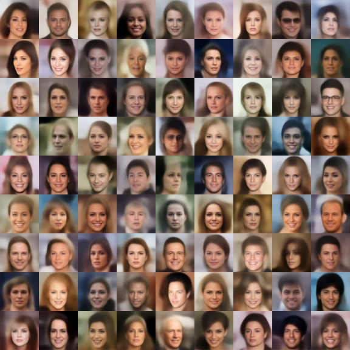
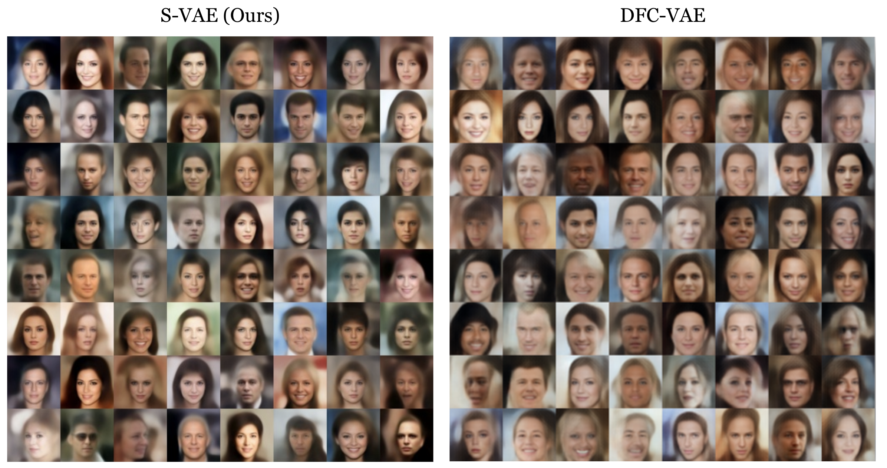

# A Style Based Variational Autoencoder

## Abstract
VAE are among the state of the art generative models, but have recently lost their shine to GANs. 
The most prominent work recently in which is the style-gan by [Karras et al.](https://arxiv.org/abs/1812.04948) 
VAE has the ability to encode as well as decode - this advantage over the style-gan is useful in many downstream tasks.
In this work we combine the style based architecture and VAE and achieve state of the art reconstruction and generation. 
We follow the work of [Hou et al.](https://ieeexplore.ieee.org/abstract/document/7926714/) 
to use perceptual loss and we compare our results to it.

## Architecture

The loss is comprised out of two components:
* **Reconstruction Loss** - based on perceptual loss (pre-trained VGG16 features)
* **Latent Loss** - kl-divergence loss

## Reconstruction Results

    

## Random Sample Results

   

## Interpolation
   
   

## Comparison to state of The Art

   

## Code Structure
* **. /Model**
  * Layers class [`VaeLayers`](style_vae/model/layers.py)
  * The perceptual model class [`PerceptualModel`](style_vae/model/perceptual_model.py)
  * Our model class [`StyleVae`](style_vae/model/style_vae.py)
* **. /Train**
  * The trainer class [`StyleVaeTrainer`](style_vae/model/style_vae.py)
  * [Train script](style_vae/train/train.py) `$ python train.py --load <True|False>`
  * [Test script](style_vae/train/test.py) `$ python test.py`
  * All saved models should be saved under [`./train_output`](style_vae/train_output) to restore
* **. /Data**
  * Dataset class [`Dataset`](style_vae/data/dataset.py) 
  * All data should be saved under `/data/svae/*.png`
  
## Training Curves

### Train

### Validation

### Test
test results can be seen in the visuals part
 
  
