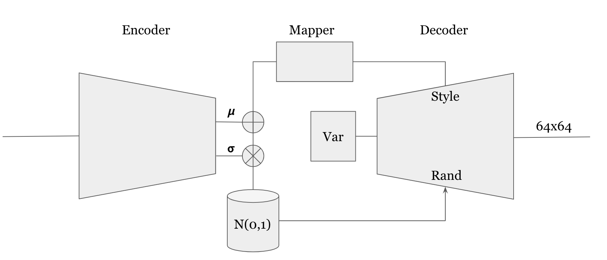
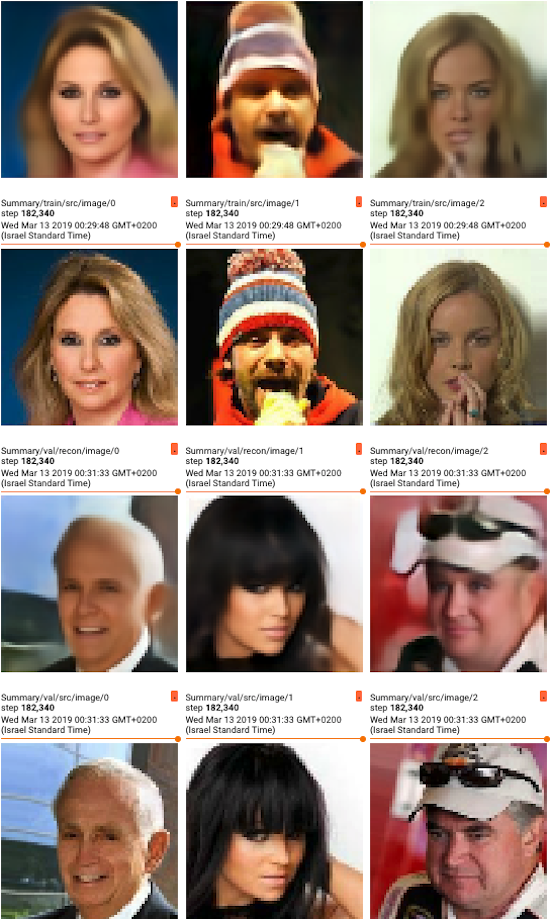
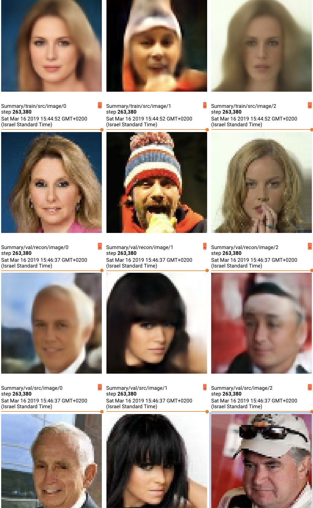

# A Style Based Variational Autoencoder

## Architecture

## Loss
The loss is comprised out of two components:
* **Reconstruction Loss** - based on perceptual loss (pre-trained VGG16 features)
* **Latent Loss** - kl-divergence loss 

## Reconstruction Results
* **512 params:**

* **100 params:**

